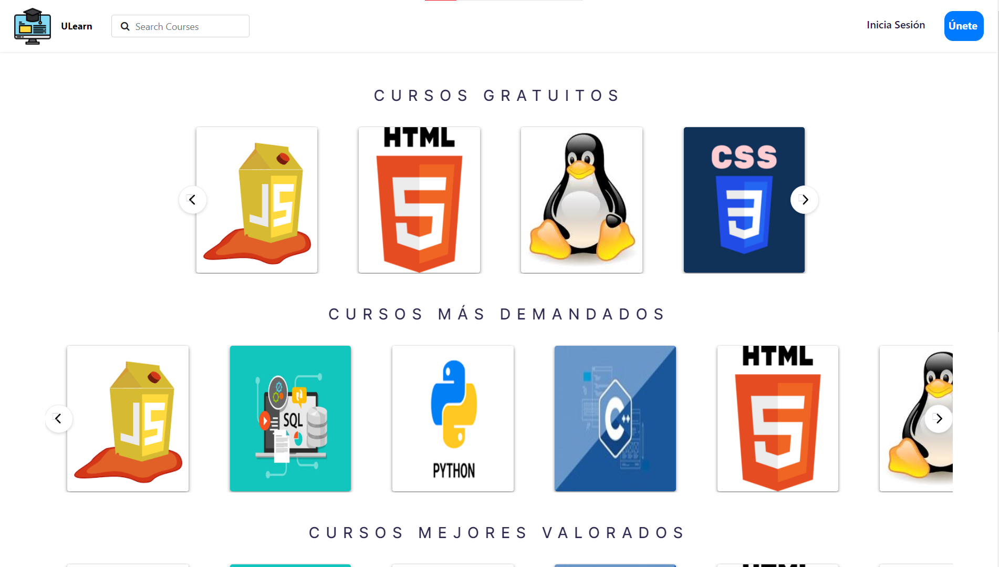
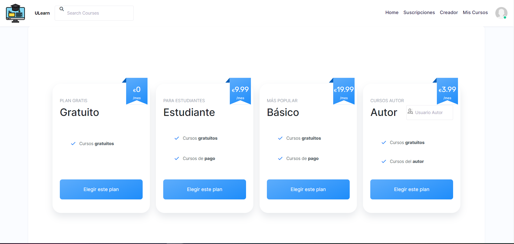
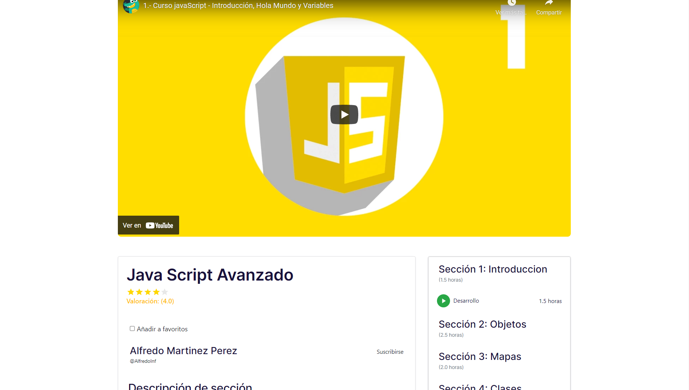
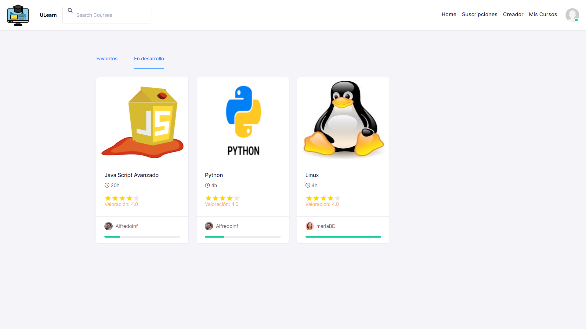
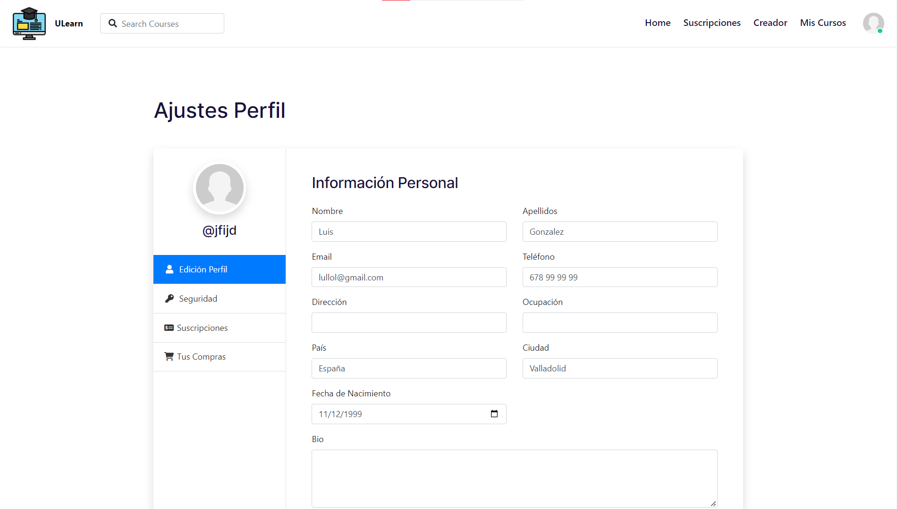

# Proyecto-WEB: ULearn

Servicio web destinado a facilitar la educación tecnológica a distancia para la transmisión de los conocimientos informáticos, tanto para alumnos como profesionales del sector que quieran aprender o educar.

